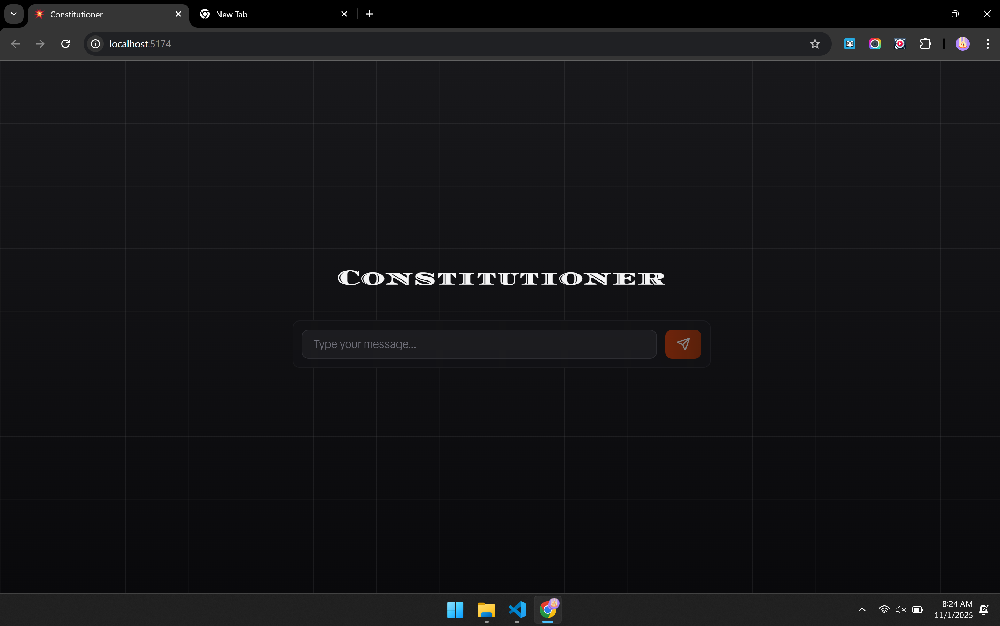

# Constitutioner

Constitutioner is a **Retrieval-Augmented Generation (RAG) tool** that allows users to **query the Indian Constitution interactively**.
It fetches the most relevant sections using **semantic search with Pinecone** and provides **context-aware answers using an LLM**.

##  Features

* Chunked storage of the Indian Constitution using Pinecone DB
* Cosine similarity search to fetch relevant context
* RAG-based inference for accurate and context-rich answers
* **Both GUI and CLI versions** – run locally or access via the web
* Lightweight backend (no heavy embedding models hosted manually)

##  Tech Stack

* **Backend**: FastAPI
* **Vector DB**: Pinecone (with server-side embeddings)
* **LLM API**: OpenRouterAI API
* **Deployment**: Render (backend) + Vercel (frontend)

## ⚡ How It Works

1️⃣ The Indian Constitution is preprocessed and **chunked into meaningful sections**.
2️⃣ Each chunk is embedded and stored in **Pinecone DB**.
3️⃣ When a user queries, Pinecone **fetches the top-k relevant chunks** via cosine similarity.
4️⃣ These chunks are passed as **context to the LLM**, which generates a **final answer**.

## 📦 Installation (CLI Version)

```bash
git clone https://github.com/varshithpilli/constitutioner.git
cd constitutioner
pip install -r requirements.txt
```

Create a `.env` file:

```
API_KEY="sk-or-v1-...."
BASE_URL="https://openrouter.ai/api/v1/chat/completions"
MODEL="mistralai/mistral-small-3.2-24b-instruct:free"
PINECONE_API="pcsk_...."
```

Run the CLI version:

```bash
py cli_model.py
```

## Key Takeaway

Constitutioner shows how **RAG + Pinecone** can be used to build **lightweight, scalable, and cost-efficient AI apps** without hosting heavy embedding models locally.

---

## Screenshots

CLI Version


Desktop Version



Mobile Version


